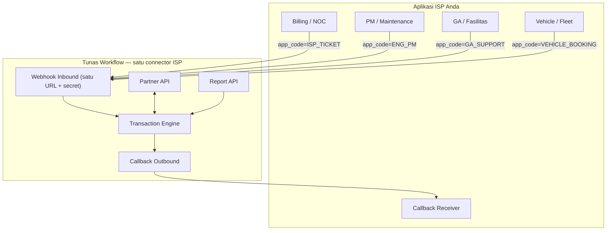

# Panduan Integrasi ISP — Tunas Workflow

**Dokumen ini khusus untuk tim development produk ISP (external).**  
Gunakan sebagai acuan mulai development integrasi dengan platform Tunas Workflow.

| Item | Nilai |
|------|--------|
| Versi API | 1.0 |
| Aplikasi target | `ISP_TICKET`, `ENG_PM`, `GA_SUPPORT`, `VEHICLE_BOOKING` |
| Environment staging/production | `http://103.94.238.207:3050` |
| Base API | `http://103.94.238.207:3050/api` |
| Tenant code (demo) | `01` |
| API Key demo | `tunas-demo-webhook-secret-2024` |

> **Penting:** Untuk production, minta API Key resmi ke admin Tunas Workflow. Jangan pakai demo key di lingkungan live pelanggan.

---

## Daftar Isi

1. [Gambaran arsitektur](#1-gambaran-arsitektur)
2. [Alur proses tiket](#2-alur-proses-tiket)
3. [Kredensial & setup awal](#3-kredensial--setup-awal)
4. [Langkah development (step-by-step)](#4-langkah-development-step-by-step)
5. [Referensi API lengkap](#5-referensi-api-lengkap)
6. [Callback outbound (Tunas → ISP)](#6-callback-outbound-tunas--isp)
7. [Mapping data](#7-mapping-data)
8. [Error handling](#8-error-handling)
9. [Testing & validasi](#9-testing--validasi)
10. [Checklist go-live](#10-checklist-go-live)
11. [FAQ](#11-faq)

---

## 1. Gambaran arsitektur

Tunas Workflow adalah platform tiket terpusat. Aplikasi ISP Anda **tidak perlu** membuat tabel tiket sendiri — cukup sinkronkan lewat API.



### Satu webhook untuk semua modul — apakah aman?

**Ya, aman dan direkomendasikan.** Satu tenant ISP cukup memakai:

| Item | Jumlah | Keterangan |
|------|--------|------------|
| Webhook URL | **1** | `POST /integration/isp/{tenant}/webhook` |
| API Key / Secret | **1** | Header `X-Api-Key` atau `X-Webhook-Secret` |
| Callback URL | **1** | Terima event dari semua modul |

**Cara membedakan modul:** kirim field `app_code` di body webhook (default `ISP_TICKET` jika tidak diisi — backward compatible).

**Mengapa aman:**

1. **Autentikasi per tenant** — secret hanya berlaku untuk tenant Anda; request tanpa secret ditolak (401).
2. **Routing eksplisit** — setiap request wajib (atau default) menyebut `app_code`; transaksi masuk ke engine modul yang benar (`ISP_TICKET`, `ENG_PM`, dll.), tidak tercampur.
3. **Whitelist modul** — hanya 4 `app_code` bundle ISP yang diterima; nilai lain ditolak (400).
4. **Callback memuat `app_code`** — receiver ISP bisa route update ke modul internal yang sesuai.
5. **Satu secret = lebih mudah dirotasi** — rotate key sekali, semua modul ikut ter-update.

**Yang perlu dilakukan di sisi ISP:** selalu set `app_code` yang benar saat POST webhook, dan simpan `app_code` dari response/callback bersama `trx_no`.

### Dua arah integrasi

| Arah | Mekanisme | Kapan dipakai |
|------|-----------|---------------|
| **ISP → Tunas (Push)** | Webhook create, PATCH status, POST log | Complaint baru, update proses dari app ISP |
| **ISP ← Tunas (Pull)** | GET tickets, GET report | Sync berkala, dashboard reporting |
| **Tunas → ISP (Push)** | Callback URL yang Anda sediakan | Notifikasi real-time saat status berubah di Tunas |

Anda bisa kombinasi **callback (real-time)** + **polling (backup sync)**.

---

## 2. Alur proses per modul

Bundle aplikasi ISP mencakup **empat modul**. Setiap modul punya `app_code` dan alur proses sendiri:

| app_code | Modul | Alur proses |
|----------|-------|-------------|
| `ISP_TICKET` | ISP Ticketing | REQUEST → ASSIGN → DISPATCH → WORKING → RESOLVED → CLOSE |
| `ENG_PM` | Preventive Maintenance | SCHEDULED → EXECUTE → CHECKLIST → VERIFY → CLOSE |
| `GA_SUPPORT` | GA Support | REQUEST → ASSIGN → WORKING → RESOLVED → CLOSE |
| `VEHICLE_BOOKING` | Vehicle Booking | REQUEST → APPROVAL → ASSIGN → ACTIVE → RETURN → CLOSE |

Gunakan `GET /processes` untuk melihat semua flow, atau `GET /processes?app_code=ENG_PM` per modul.

**Status transaksi (semua modul):** `OPEN` · `CLOSED` · `REJECTED`  
**SLA status:** `ON_TRACK` · `AT_RISK` · `BREACHED` · `MET`

### 2.1 ISP Ticketing (`ISP_TICKET`)

| Urutan | Kode proses | Nama | Keterangan |
|--------|-------------|------|------------|
| 1 | `REQUEST` | Complaint | Tiket baru masuk (otomatis dari webhook) |
| 2 | `ASSIGN` | Assign | Ditugaskan ke tim/teknisi |
| 3 | `DISPATCH` | Dispatch | Dikirim ke lapangan |
| 4 | `WORKING` | Field Work | Teknisi sedang kerja di lokasi |
| 5 | `RESOLVED` | Resolved | Masalah selesai diperbaiki |
| 6 | `CLOSE` | Close | Tiket ditutup (final) |

### 2.2 Preventive Maintenance (`ENG_PM`)

| Urutan | Kode proses | Nama | Keterangan |
|--------|-------------|------|------------|
| 1 | `SCHEDULED` | Scheduled | Jadwal PM / request PM masuk |
| 2 | `EXECUTE` | Execute | Teknisi mulai eksekusi |
| 3 | `CHECKLIST` | Checklist | Isi checklist pemeriksaan |
| 4 | `VERIFY` | Verify | Verifikasi hasil PM |
| 5 | `CLOSE` | Close | PM selesai (final) |

### 2.3 GA Support (`GA_SUPPORT`)

| Urutan | Kode proses | Nama | Keterangan |
|--------|-------------|------|------------|
| 1 | `REQUEST` | Request | Permintaan GA (ATK, fasilitas, kebersihan, dll.) |
| 2 | `ASSIGN` | Assign | Ditugaskan ke tim GA |
| 3 | `WORKING` | Working | Sedang ditangani |
| 4 | `RESOLVED` | Resolved | Selesai ditangani |
| 5 | `CLOSE` | Close | Ditutup (final) |

### 2.4 Vehicle Booking (`VEHICLE_BOOKING`)

| Urutan | Kode proses | Nama | Keterangan |
|--------|-------------|------|------------|
| 1 | `REQUEST` | Request | Permintaan peminjaman kendaraan |
| 2 | `APPROVAL` | Approval | Persetujuan atasan |
| 3 | `ASSIGN` | Assign Vehicle | Kendaraan & driver ditetapkan |
| 4 | `ACTIVE` | In Use | Kendaraan sedang dipakai |
| 5 | `RETURN` | Return | Pengembalian kendaraan |
| 6 | `CLOSE` | Close | Booking selesai (final) |

---

## 3. Kredensial & setup awal

### 3.1 Yang perlu diminta ke admin Tunas

| Item | Contoh | Kegunaan |
|------|--------|----------|
| `tenant_code` | `01` | Path URL semua endpoint |
| `api_key` / `webhook_secret` | `xxxx...` | Autentikasi request |
| Daftar `domain_code` / area | `01.ISP01`, `01.ISP02` | Mapping cluster pelanggan |
| (Opsional) UUID user teknisi | UUID dari Tunas | Untuk action `ASSIGN` |

### 3.2 Header autentikasi

Semua request ke Partner API:

```http
Content-Type: application/json
X-Api-Key: <api_key_anda>
```

Atau (setara):

```http
X-Webhook-Secret: <api_key_anda>
```

### 3.3 Base URL Partner API

```
http://103.94.238.207:3050/api/integration/isp/{tenant_code}
```

Contoh tenant `01`:

```
http://103.94.238.207:3050/api/integration/isp/01
```

### 3.4 Tools yang disediakan

| Tool | Lokasi |
|------|--------|
| Postman collection | `docs/postman/ISP-Partner-API.postman_collection.json` |
| Smoke test script | `bash scripts/isp-partner-api-test.sh` |
| Dokumen umum integrasi | `docs/integration-api.md` |

---

## 4. Langkah development (step-by-step)

### Step 1 — Verifikasi koneksi

**Tujuan:** Pastikan API key valid dan flow proses terbaca.

```bash
curl "http://103.94.238.207:3050/api/integration/isp/01/processes" \
  -H "X-Api-Key: tunas-demo-webhook-secret-2024"
```

**Response yang diharapkan:** JSON berisi `supported_apps` dan flow proses per modul (`ISP_TICKET`, `ENG_PM`, `GA_SUPPORT`, `VEHICLE_BOOKING`).

**Development task di sisi ISP:**
- [ ] Simpan `base_url`, `tenant_code`, `api_key` di config/environment
- [ ] Buat HTTP client dengan header auth standar
- [ ] Cache flow proses per `app_code` dari response `/processes`

---

### Step 2 — Push: buat transaksi via webhook (semua modul)

**Tujuan:** Saat ada event di sistem ISP (complaint, PM, GA, booking kendaraan), buat transaksi di Tunas.

**Satu endpoint untuk semua modul:**

```
POST /api/integration/isp/{tenant_code}/webhook
```

**Header:** `X-Webhook-Secret` atau `X-Api-Key` (secret yang sama untuk semua modul)

**Field umum (semua `app_code`):**

| Field | Wajib | Keterangan |
|-------|-------|------------|
| `app_code` | Disarankan | `ISP_TICKET` (default) · `ENG_PM` · `GA_SUPPORT` · `VEHICLE_BOOKING` |
| `description` | ✅ | Deskripsi / detail permintaan |
| `title` | Opsional | Judul (auto-generate jika kosong) |
| `priority` | Opsional | `LOW` · `MEDIUM` · `HIGH` · `CRITICAL` |
| `domain_code` | Opsional | Kode domain Tunas, contoh `01.L01.Z01` |
| `details` | Opsional | Object field tambahan → `transaction_detail` |

---

#### 2a. ISP Ticketing (`ISP_TICKET`) — default

Body **tanpa** `app_code` = dianggap `ISP_TICKET` (backward compatible).

```json
{
  "event": "CUSTOMER_COMPLAINT",
  "customer_id": "CUST-1001",
  "customer_name": "Budi Santoso",
  "area": "01.ISP01",
  "device_serial": "ONT-8821",
  "description": "Internet putus sejak pagi, lampu LOS merah",
  "priority": "HIGH"
}
```

| event | Kapan dipanggil |
|-------|-----------------|
| `CUSTOMER_COMPLAINT` | Pelanggan komplain via call center / app |
| `DEVICE_OFFLINE` | ONT/CPE terdeteksi offline di billing |
| `PACKAGE_ISSUE` | Masalah paket/langganan |

**Field wajib khusus ISP_TICKET:** `customer_name`, `area`

```bash
curl -X POST "http://103.94.238.207:3050/api/integration/isp/01/webhook" \
  -H "Content-Type: application/json" \
  -H "X-Webhook-Secret: tunas-demo-webhook-secret-2024" \
  -d '{
    "app_code": "ISP_TICKET",
    "event": "DEVICE_OFFLINE",
    "customer_id": "CUST-1001",
    "customer_name": "Budi Santoso",
    "area": "01.ISP01",
    "device_serial": "ONT-8821",
    "description": "ONT offline terdeteksi billing",
    "priority": "HIGH"
  }'
```

---

#### 2b. Preventive Maintenance (`ENG_PM`)

```json
{
  "app_code": "ENG_PM",
  "title": "PM Bulanan Genset Site A",
  "description": "Jadwal PM genset 500 KVA — checklist bulan Juni",
  "priority": "MEDIUM",
  "domain_code": "01.L01.Z01",
  "details": {
    "affected_asset": "GENSET-500-A",
    "frequency": "MONTHLY"
  }
}
```

**Kapan dipanggil:** jadwal PM dari sistem maintenance ISP, alert mesin, atau request PM ad-hoc.

---

#### 2c. GA Support (`GA_SUPPORT`)

```json
{
  "app_code": "GA_SUPPORT",
  "title": "Permintaan ATK Lantai 3",
  "description": "Stok kertas A4 dan toner printer habis",
  "priority": "LOW",
  "domain_code": "01.L01",
  "details": {
    "category": "SUPPLIES",
    "location": "Gedung A Lantai 3"
  }
}
```

**Kapan dipanggil:** permintaan fasilitas, kebersihan, ATK, perbaikan gedung dari portal internal ISP.

---

#### 2d. Vehicle Booking (`VEHICLE_BOOKING`)

```json
{
  "app_code": "VEHICLE_BOOKING",
  "title": "Booking mobil operasional NOC",
  "description": "Kunjungan site pelanggan cluster B",
  "priority": "MEDIUM",
  "details": {
    "purpose": "Site visit pelanggan",
    "start_date": "2026-06-26",
    "end_date": "2026-06-26",
    "destination": "Cluster B - Bekasi"
  }
}
```

**Kapan dipanggil:** permintaan peminjaman kendaraan dari HR/fleet/operasional ISP.

---

**Response (201) — semua modul:**

```json
{
  "success": true,
  "data": {
    "event_id": "uuid",
    "transaction_id": "uuid",
    "trx_no": "TW00042",
    "app_code": "GA_SUPPORT"
  },
  "message": "ISP ticket created"
}
```

**Development task di sisi ISP:**
- [ ] **Satu webhook client** — URL & secret sama, bedakan lewat `app_code`
- [ ] Trigger webhook per modul (billing → `ISP_TICKET`, fleet → `VEHICLE_BOOKING`, dll.)
- [ ] **Simpan `trx_no` + `app_code`** di database ISP sebagai foreign key
- [ ] Handle error 401 (key salah) dan 400 (`APP_NOT_ENABLED`, validasi field)

---

### Step 3 — Pull: baca daftar & detail tiket

**Tujuan:** Tampilkan tiket Tunas di dashboard ISP atau sync berkala.

#### 3a. List tiket

```
GET /api/integration/isp/{tenant_code}/tickets
```

**Query parameters:**

| Parameter | Tipe | Keterangan |
|-----------|------|------------|
| `app_code` | string | Filter modul: `ISP_TICKET` · `ENG_PM` · `GA_SUPPORT` · `VEHICLE_BOOKING` (kosong = semua) |
| `status` | string | `OPEN` · `CLOSED` · `REJECTED` |
| `process` | string | Proses saat ini (sesuai modul, lihat §2) |
| `area` | string | Filter area pelanggan (utama untuk `ISP_TICKET`) |
| `customer_id` | string | Filter ID pelanggan ISP |
| `since` | ISO datetime | Transaksi yang di-update sejak waktu ini |
| `page` | number | Default 1 |
| `limit` | number | Default 20, max 100 |

```bash
# Semua modul — open only
curl "http://103.94.238.207:3050/api/integration/isp/01/tickets?status=OPEN&limit=20" \
  -H "X-Api-Key: tunas-demo-webhook-secret-2024"

# Hanya GA Support
curl "http://103.94.238.207:3050/api/integration/isp/01/tickets?app_code=GA_SUPPORT&status=OPEN" \
  -H "X-Api-Key: tunas-demo-webhook-secret-2024"
```

**Item response (ringkas):**

```json
{
  "transaction_id": "uuid",
  "trx_no": "TW00042",
  "app_code": "ISP_TICKET",
  "status": "OPEN",
  "current_process": "DISPATCH",
  "priority": "HIGH",
  "sla_status": "ON_TRACK",
  "customer_id": "CUST-1001",
  "customer_name": "Budi Santoso",
  "area": "01.ISP01",
  "title": "ISP Complaint - Budi Santoso",
  "complaint": "Internet putus...",
  "available_transitions": ["WORKING"],
  "created_at": "2026-06-25T10:00:00.000Z"
}
```

> Field `customer_*` dan `area` terisi untuk `ISP_TICKET`. Modul lain mengembalikan `title` + `complaint`/`description`.

#### 3b. Detail tiket + timeline

```
GET /api/integration/isp/{tenant_code}/tickets/{trx_no}
```

Response tambahan: `logs[]`, `assets[]`, `process_flow[]`, `available_transitions[]`.

**Development task di sisi ISP:**
- [ ] Halaman list tiket — poll `GET /tickets?status=OPEN` setiap 1–5 menit (atau pakai callback Step 6)
- [ ] Halaman detail — `GET /tickets/{trx_no}`
- [ ] Tampilkan `available_transitions` sebagai tombol aksi yang valid

---

### Step 4 — Push: update status proses

**Tujuan:** Saat NOC/dispatcher/teknisi update status di app ISP, sync ke Tunas.

```
PATCH /api/integration/isp/{tenant_code}/tickets/{trx_no}
```

**Body:**

```json
{
  "action": "ADVANCE",
  "to_process": "DISPATCH",
  "comment": "Dikirim ke teknisi Ahmad",
  "operator": "ISP-NOC-01"
}
```

**Action yang didukung:**

| action | Keterangan | Field tambahan |
|--------|------------|----------------|
| `ADVANCE` | Pindah ke proses berikutnya | `to_process` (wajib jika banyak opsi) |
| `ASSIGN` | Assign ke user Tunas | `assign_to` (UUID user), `to_process` |
| `CLOSE` | Tutup tiket | `to_process`: `CLOSE` |
| `REJECT` | Tolak tiket | — |

**Contoh alur lengkap (`ISP_TICKET`):**

```bash
# REQUEST → ASSIGN
curl -X PATCH ".../tickets/TW00042" -H "X-Api-Key: ..." \
  -d '{"action":"ADVANCE","to_process":"ASSIGN","operator":"NOC"}'

# ... lanjutkan sesuai flow modul — baca available_transitions dari GET detail
```

**Contoh singkat modul lain:**

```bash
# ENG_PM: SCHEDULED → EXECUTE
curl -X PATCH ".../tickets/TW00050" -d '{"action":"ADVANCE","to_process":"EXECUTE","operator":"pm-team"}'

# GA_SUPPORT: REQUEST → ASSIGN
curl -X PATCH ".../tickets/TW00051" -d '{"action":"ADVANCE","to_process":"ASSIGN","operator":"ga-desk"}'

# VEHICLE_BOOKING: REQUEST → APPROVAL
curl -X PATCH ".../tickets/TW00052" -d '{"action":"ADVANCE","to_process":"APPROVAL","operator":"fleet-admin"}'
```

**Development task di sisi ISP:**
- [ ] Mapping tombol/status UI ISP ke `to_process` **per modul** (flow berbeda, lihat §2)
- [ ] Selalu kirim `operator` (username/kode NOC/teknisi) untuk audit trail
- [ ] Sebelum PATCH, baca `available_transitions` dari GET detail agar tidak invalid transition
- [ ] Gunakan `app_code` dari GET detail untuk menampilkan UI yang sesuai

---

### Step 5 — Push: tambah catatan teknisi

**Tujuan:** Log pekerjaan lapangan tanpa mengubah proses.

```
POST /api/integration/isp/{tenant_code}/tickets/{trx_no}/logs
```

```json
{
  "action": "FIELD_NOTE",
  "description": "Sudah cek kabel drop, sinyal -18 dBm",
  "operator": "tech-ahmad"
}
```

**Development task di sisi ISP:**
- [ ] Form catatan teknisi di app mobile/web ISP → POST log
- [ ] Tampilkan `logs[]` dari GET detail sebagai timeline

---

### Step 6 — Callback outbound (Tunas push ke ISP)

**Tujuan:** Terima notifikasi real-time saat tiket berubah di Tunas (termasuk perubahan dari web Tunas oleh operator internal).

#### Setup

1. Buat endpoint di aplikasi ISP, contoh:
   ```
   POST https://isp-app.example.com/api/tunas/callback
   ```
2. Minta admin Tunas isi **Callback URL** di Integration Marketplace → ISP Billing
3. (Opsional) Set **Callback Secret** — Tunas kirim sebagai header `X-Callback-Secret`

#### Event yang dikirim Tunas

| event | Kapan |
|-------|-------|
| `TICKET_CREATED` | Tiket baru dibuat (webhook) |
| `TICKET_STATUS_CHANGED` | Proses berubah |
| `TICKET_CLOSED` | Tiket ditutup |
| `TICKET_LOG_ADDED` | Log baru |

#### Payload contoh

```json
{
  "event": "TICKET_STATUS_CHANGED",
  "trx_no": "TW00042",
  "transaction_id": "ea846b7c-474e-4811-9ca4-1688ebb94e76",
  "app_code": "ISP_TICKET",
  "status": "OPEN",
  "current_process": "WORKING",
  "from_process": "DISPATCH",
  "to_process": "WORKING",
  "customer_id": "CUST-1001",
  "customer_name": "Budi Santoso",
  "area": "01.ISP01",
  "priority": "HIGH",
  "sla_status": "ON_TRACK",
  "updated_at": "2026-06-25T12:00:00.000Z",
  "operator": "ISP-NOC-01",
  "comment": "Teknisi sudah di lapangan"
}
```

#### Contoh receiver minimal (Node.js / Express)

```javascript
app.post('/api/tunas/callback', (req, res) => {
  const secret = req.headers['x-callback-secret'];
  if (secret !== process.env.TUNAS_CALLBACK_SECRET) {
    return res.status(401).json({ error: 'Unauthorized' });
  }

  const payload = req.body;
  console.log('Tunas event:', payload.event, payload.trx_no);

  // Update database ISP berdasarkan trx_no
  // await updateTicket(payload.trx_no, payload.current_process, payload.status);

  res.status(200).json({ received: true });
});
```

**Development task di sisi ISP:**
- [ ] Implementasi endpoint callback + validasi secret
- [ ] Update record lokal berdasarkan `trx_no`
- [ ] Return HTTP 200 cepat (< 15 detik timeout Tunas)
- [ ] Idempotent: handle event duplikat dengan aman

---

### Step 7 — Pull: reporting

**Tujuan:** Dashboard KPI di aplikasi ISP — per modul (`app_code`) dan per periode bulan/tahun.

```
GET /api/integration/isp/{tenant_code}/report?app_code={app}&type={type}&period={month|year}&year=2026&month=6
GET /api/integration/isp/{tenant_code}/reports/bundle?app_code={app}&period=year&year=2026
```

| type | Isi laporan |
|------|-------------|
| `complaint` | Laporan komplain — total, open/closed/rejected, breakdown per bulan (tahunan) |
| `sla` | SLA penanganan — kepatuhan %, breach, rata-rata jam penyelesaian |
| `asset_usage` | Pemakaian sparepart & alat — qty per kode aset, breakdown bulanan |

**Periode:**
- `period=month&year=2026&month=6` → Juni 2026
- `period=year&year=2026` → seluruh tahun 2026 (dengan breakdown per bulan)

```bash
# Laporan komplain bulan ini
curl "http://103.94.238.207:3050/api/integration/isp/01/report?app_code=ISP_TICKET&type=complaint&period=month&year=2026&month=6" \
  -H "X-Api-Key: tunas-demo-webhook-secret-2024"

# SLA tahunan + semua laporan sekaligus
curl "http://103.94.238.207:3050/api/integration/isp/01/reports/bundle?app_code=GA_SUPPORT&period=year&year=2026" \
  -H "X-Api-Key: tunas-demo-webhook-secret-2024"
```

Ulangi untuk setiap `app_code`: `ISP_TICKET`, `ENG_PM`, `GA_SUPPORT`, `VEHICLE_BOOKING`.

**Development task di sisi ISP:**
- [ ] Widget dashboard per modul: komplain, SLA, sparepart/alat
- [ ] Filter bulan/tahun di UI reporting
- [ ] Export/sync ke data warehouse jika diperlukan

---

## 5. Referensi API lengkap

| # | Method | Endpoint | Arah | Fungsi |
|---|--------|----------|------|--------|
| 1 | `POST` | `/integration/isp/{tenant}/webhook` | ISP → Tunas | Buat tiket |
| 2 | `GET` | `/integration/isp/{tenant}/tickets` | ISP ← Tunas | List tiket |
| 3 | `GET` | `/integration/isp/{tenant}/tickets/{trxNo}` | ISP ← Tunas | Detail tiket |
| 4 | `PATCH` | `/integration/isp/{tenant}/tickets/{trxNo}` | ISP → Tunas | Update proses |
| 5 | `POST` | `/integration/isp/{tenant}/tickets/{trxNo}/logs` | ISP → Tunas | Tambah log |
| 6 | `GET` | `/integration/isp/{tenant}/report` | ISP ← Tunas | Laporan per modul & periode |
| 7 | `GET` | `/integration/isp/{tenant}/reports/bundle` | ISP ← Tunas | Komplain + SLA + sparepart sekaligus |
| 8 | `GET` | `/integration/isp/{tenant}/processes` | ISP ← Tunas | Flow proses |

### Format response standar

**Sukses:**

```json
{
  "success": true,
  "data": { },
  "message": ""
}
```

**Error:**

```json
{
  "success": false,
  "errorCode": "INVALID_TRANSITION",
  "message": "Cannot transition from DISPATCH to CLOSE"
}
```

---

## 6. Callback outbound (Tunas → ISP)

Lihat [Step 6](#step-6--callback-outbound-tunas-push-ke-isp) di atas.

**Rekomendasi arsitektur sync:**

```
┌─────────────────────────────────────────────────────┐
│  Sumber kebenaran proses: TUNAS WORKFLOW            │
│  Sumber kebenaran pelanggan: APLIKASI ISP           │
└─────────────────────────────────────────────────────┘

Primary sync:  Callback (real-time)
Fallback sync: GET /tickets?since=<last_sync_at> setiap 5 menit
```

---

## 7. Mapping data

### Field umum (semua modul)

| Field Tunas | Sumber di ISP | Keterangan |
|-------------|---------------|------------|
| `trx_no` | Response webhook | **Primary key** untuk semua API selanjutnya |
| `transaction_id` | Response webhook | UUID internal Tunas |
| `app_code` | Request webhook / response | Modul: `ISP_TICKET` · `ENG_PM` · `GA_SUPPORT` · `VEHICLE_BOOKING` |
| `title` | Judul permintaan | |
| `description` / `complaint` | Deskripsi | |
| `current_process` | Status workflow | Sesuai flow modul (§2) |
| `priority` | Prioritas | `LOW` · `MEDIUM` · `HIGH` · `CRITICAL` |
| `sla_status` | Status SLA | `ON_TRACK` · `AT_RISK` · `BREACHED` · `MET` |
| `domain_code` | Lokasi / site | Opsional, kode domain Tunas |

### Field khusus per modul

#### `ISP_TICKET`

| Field | Keterangan |
|-------|------------|
| `customer_id` | ID pelanggan billing |
| `customer_name` | Nama pelanggan (wajib di webhook) |
| `area` | Cluster/kecamatan (wajib di webhook) |
| `device` / `device_serial` | Serial ONT/CPE |
| `source_event` | `CUSTOMER_COMPLAINT`, `DEVICE_OFFLINE`, `PACKAGE_ISSUE` |

#### `ENG_PM`

| Field (`details`) | Keterangan |
|-------------------|------------|
| `affected_asset` | Kode asset yang di-PM |
| `frequency` | `MONTHLY`, `WEEKLY`, `ADHOC`, dll. |
| `checklist` | Item checklist (bisa diisi via web Tunas) |

#### `GA_SUPPORT`

| Field (`details`) | Keterangan |
|-------------------|------------|
| `category` | `SUPPLIES`, `CLEANING`, `FACILITY`, `GENERAL`, dll. |
| `location` | Lokasi gedung/lantai |

#### `VEHICLE_BOOKING`

| Field (`details`) | Keterangan |
|-------------------|------------|
| `purpose` | Tujuan peminjaman |
| `start_date` | Tanggal mulai (ISO atau `YYYY-MM-DD`) |
| `end_date` | Tanggal selesai |
| `destination` | Tujuan perjalanan |

### Mapping area → domain (opsional)

Jika area ISP sama dengan kode domain Tunas, gunakan langsung:

| Area ISP | domain_code Tunas |
|----------|-------------------|
| Cluster ISP 01 | `01.ISP01` |
| Cluster ISP 02 | `01.ISP02` |

Tanyakan daftar lengkap ke admin Tunas.

---

## 8. Error handling

| HTTP | errorCode | Penyebab | Solusi |
|------|-----------|----------|--------|
| 401 | `API_UNAUTHORIZED` | API key salah | Cek key di config |
| 401 | `WEBHOOK_UNAUTHORIZED` | Secret webhook salah | Cek header |
| 404 | `TICKET_NOT_FOUND` | `trx_no` tidak ada | Cek typo / tenant |
| 404 | `CONNECTOR_NOT_INSTALLED` | ISP connector belum aktif | Hubungi admin Tunas |
| 400 | `INVALID_TRANSITION` | `to_process` tidak valid | Baca `available_transitions` |
| 400 | `TICKET_CLOSED` | Tiket sudah ditutup | Jangan update lagi |
| 400 | `INVALID_APP` | `app_code` tidak dikenali | Gunakan salah satu dari 4 modul bundle |
| 400 | `APP_NOT_ENABLED` | Modul tidak diaktifkan | Hubungi admin Tunas |
| 400 | `AMBIGUOUS_ROUTING` | Banyak opsi transisi | Wajib kirim `to_process` |

> Validasi webhook: `customer_name` + `area` wajib hanya jika `app_code=ISP_TICKET` (atau default tanpa `app_code`).

**Best practice:**
- Log semua request/response (tanpa API key)
- Retry dengan exponential backoff untuk 5xx
- Jangan retry 4xx kecuali 429

---

## 9. Testing & validasi

### 9.1 Smoke test otomatis

```bash
# Dari repo tunas-workflow
bash scripts/isp-partner-api-test.sh

# Atau dengan env custom
BASE_URL=http://103.94.238.207:3050/api/integration/isp/01 \
API_KEY=your-key-here \
bash scripts/isp-partner-api-test.sh
```

### 9.2 Postman

1. Import file: `docs/postman/ISP-Partner-API.postman_collection.json`
2. Set variables: `base_url`, `tenant_code`, `api_key`
3. Jalankan folder **Push — Create Ticket** → copy `trx_no` ke variable
4. Jalankan folder **Push — Update Status** berurutan

### 9.3 Skenario uji manual

| # | Skenario | Expected |
|---|----------|----------|
| 1 | Webhook `ISP_TICKET` complaint | `app_code=ISP_TICKET`, `current_process=REQUEST` |
| 2 | Webhook `ENG_PM` | `app_code=ENG_PM`, `current_process=SCHEDULED` |
| 3 | Webhook `GA_SUPPORT` | `app_code=GA_SUPPORT`, `current_process=REQUEST` |
| 4 | Webhook `VEHICLE_BOOKING` | `app_code=VEHICLE_BOOKING`, `current_process=REQUEST` |
| 5 | List filter `app_code=GA_SUPPORT` | Hanya transaksi GA |
| 6 | Advance proses sesuai modul | `current_process` berubah valid |
| 7 | Add field log | `logs[]` bertambah |
| 8 | CLOSE transaksi | `status=CLOSED` |
| 9 | Callback diterima ISP | Payload berisi `app_code` + `trx_no` |
| 10 | Report per modul | `GET /report?app_code=ENG_PM&type=sla&period=month` |

---

## 10. Checklist go-live

### Tim ISP

- [ ] Environment production: `base_url`, `tenant_code`, `api_key` terpisah dari demo
- [ ] **Satu webhook URL + secret** untuk semua modul; bedakan via `app_code`
- [ ] Webhook create terintegrasi: billing (`ISP_TICKET`), PM (`ENG_PM`), GA (`GA_SUPPORT`), fleet (`VEHICLE_BOOKING`)
- [ ] `trx_no` + `app_code` disimpan di database ISP
- [ ] UI sync status (PATCH) untuk semua proses
- [ ] Callback receiver production + HTTPS
- [ ] Fallback polling `GET /tickets?since=...`
- [ ] Reporting dashboard
- [ ] Monitoring error 4xx/5xx
- [ ] Runbook jika Tunas tidak reachable

### Tim Tunas (admin)

- [ ] ISP connector aktif di Marketplace
- [ ] API key production digenerate
- [ ] Callback URL ISP terdaftar
- [ ] Mapping domain/area disepakati
- [ ] Asset ONT (opsional) terdaftar untuk link `device_serial`

---

## 11. FAQ

**Q: Apakah satu webhook aman untuk ISP Ticketing, PM, GA, dan Vehicle Booking?**  
A: **Ya.** Gunakan endpoint dan secret yang sama; tentukan modul lewat `app_code` di body. Autentikasi per tenant, routing per modul, callback menyertakan `app_code`. Lihat [Satu webhook untuk semua modul](#satu-webhook-untuk-semua-modul--apakah-aman).

**Q: Apakah kita harus implement semua endpoint sekaligus?**  
A: Tidak. Minimum viable: **webhook create** + **GET detail** + **PATCH advance**. Callback dan reporting bisa fase 2.

**Q: Siapa master data tiket?**  
A: Tunas Workflow adalah master untuk **status proses**. ISP adalah master untuk **data pelanggan**.

**Q: Bisa buat transaksi dari app ISP tanpa webhook?**  
A: Webhook adalah cara yang disediakan untuk create dari sistem eksternal (semua modul). Untuk create manual, operator bisa pakai web Tunas.

**Q: Perlu webhook URL terpisah per modul?**  
A: **Tidak.** Satu URL cukup. Pisahkan hanya jika kebijakan internal ISP mengharuskan (bukan requirement Tunas).

**Q: Bagaimana jika teknisi update di web Tunas, bukan di app ISP?**  
A: Pakai **callback outbound** (Step 6) atau polling `GET /tickets?since=...`.

**Q: `assign_to` isinya apa?**  
A: UUID user di Tunas Workflow. Minta daftar teknisi + UUID ke admin, atau skip ASSIGN jika cukup ADVANCE saja.

**Q: Apakah ada rate limit?**  
A: Belum di-enforce ketat di demo. Untuk production, hormati polling maksimal setiap 1 menit per tenant.

---

## Kontak & dukungan

| Peran | Tanggung jawab |
|-------|----------------|
| Admin Tunas Workflow | API key, callback URL, mapping domain |
| Tim development ISP | Implementasi client API & callback receiver |

**Referensi teknis tambahan:** `docs/integration-api.md`

---

*Dokumen ini dibuat untuk memudahkan onboarding tim ISP. Versi terakhir: Juni 2026.*
